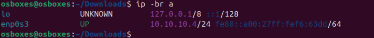
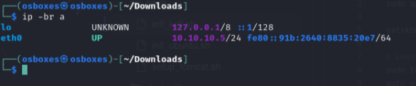

# 📜 Uitrol

## 📌 Doel

In dit project hebben wij als team gestreefd naar het implementeren van zoveel mogelijk automatiseringen, om handmatige configuraties te vermijden en tijd te besparen. Het doel was om een reproduceerbare omgeving op te zetten die in de praktijk eenvoudig hergebruikt, gedeeld en toegepast kan worden – zowel voor echte toepassingen als voor educatieve doeleinden, bijvoorbeeld met collega’s of vrienden.

In deze handleiding illustreren we het opzetten en aanvallen van een Apache-server. We gebruikten een kwetsbaarheid die we vonden in een CVE-database, namelijk CVE-2020-1938, ook wel bekend als "GhostCat". Er wordt stap voor stap uitgelegd hoe je de volledige omgeving van A tot Z kunt opzetten. Tijdens het proces kun je de kwetsbaarheden van de Apache Tomcat-server pentesten door onder andere remote code execution uit te voeren. Het oorspronkelijke plan was om ook een reverse shell op te zetten, maar wegens tijdsgebrek bij onze collega’s hebben we besloten dit onderdeel niet uit te voeren.

## 🧠 Belangrijk om te weten

De scripts werken zowel voor Windows als Linux gebruikers.

Voor te installeren van de virtuele machines (vms) hebben we twee scripts voorzien namelijk:

- init_1.ps1
- init_2.ps1

Voor de virtuele harde schijven (vdi's) hebben het volgende gebruikt:

- Ubuntu 24.10
- Kali Linux 2024.3

Het eerste script **init_1.ps1** werd gemaakt volgends de verwachtingen van de lector. Bij het uitvoeren van deze script krijgt de gebruiker een waarschuwingsbericht om te melden dat de uitvoer helemaal **afhankelijk** is van de gebruiker. Dat wil zeggen dat de vdi's vooraf geinstalleerd
moet zijn geweest en geplaatst worden in een specifieke locatie namelijk het pad: `C:\Users\<Gebruikersnaam>\Downloads` voor Windows of `/home/<gebruikersnaam>/Downloads` voor Linux. Is dit niet gedaan, dan krijgt de gebruiker de kans om dit te doen voordat de script kan starten. Omwille van deze lastige beperkingen, heb ik besloten een tweede variant van het script te maken.

Het tweede script **init_2.ps1** werd gemaakt als *uitbreiding* op de eerste script. Bij het uitvoeren van deze script krijgt de gebruiker een waarschuwingsbericht om te melden dat alles geautomatiseerd zal verlopen, de uitvoer zal helemaal **onafhankelijk** zijn van de gebruiker en is `pad locatie onafhankelijk`. Hiervoor heb ik de vdi's vooraf op OneDrive geupload en vanaf daar in PowerShell (PS) een request te doen (het zijn originele vdi's maar vanwege een timer blokkade op de sourceforge site kon PS hier niet goed mee omgaan).

❗️ **Opgelet**: Zorg ervoor dat deze vdi's niet reeds op uw computer staan en gebruikt worden door VirtualBox. VirtualBox geeft aan elke vdi een unieke UUID waardoor bij eenzelfde vdi conflicten gebeuren.

💡 *Om deze scripts overzichtelijk te houden is er bewust besloten om foutmeldingen tijdens de installaties te negeren. Indien er fouten gebeuren tijdens de installaties kan de gebruiker gewoonweg het script opnieuw/tweede keer uitvoeren, en dan krijgt de gebruiker de kans om alles te verwijderen/ongedaan maken.*

 Voor de vms setup is er gebruik gemaakt van een NatNetwerk (NN). De NN biedt een geisoleerde omgeving waarin de vms met elkaar kunnen communiceren aan de hand van ip addressen die op statische wijze worden geconfigureerd. Dit is omdat bij het NN twee port forwarding regels zijn geconfigureerd geweest bij de installatie van het NN en de vms (zie uitleg hierboven). We doen dit omdat we commando's zoals `ssh/scp` willen gebruiken vanaf onze host machine. Dit is handiger dan een sharedfolder of dergelijks. Er zijn twee shell scripts voorzien namelijk:

- init_ubuntu.sh
- init_kali.sh

Beide scripts hebben als doel om hun ip addressen te configureren op hun bijhorende interface. Niet alleen dat maar ook ssh en de toetsenbord instelling worden daarmee geinstalleerd & geconfigureerd.

Voor het uitvoeren van de shell scripts moeten die reeds aanwezig zijn op de vms. Er kan gekozen worden om de inhoud handmatig te kopieren en plakken. Vanwege de beperking met VboxManage commando's was het niet mogelijk om deze al pre-installed te krijgen op de vms. Alhoewel er creatief werd nagedacht over een oplossing was het helaas niet gelukt.

💡 *In deze handleiding wordt er zowel sharedfolders als ssh/scp commando gebruikt, dat eigenlijk niet nodig is maar om te laten zien dat het wel werkt.*

💡 *Enkel bij ubuntu is het niet gelukt om via de terminal de toetsenbord instelling te wijzigen. Wij vermoeden dat dit niet aan ons ligt maar aan osboxes zelf.*

## 🧑‍💻 Systeemvereisten om de installaties succesvol te laten verlopen

### Hardwarevereisten

- Besturingsysteemflexibiliteit: `Windows/Linux`
- Verbruik per vm:  
      - RAM: 2048MB (2GB)  
      - CPU: 2cpus  
      - VRAM: 64MB  
- Software:  
      - Oracle Virtual Box  
      - ssh  
- Vdi:  
      - Ubuntu Osboxes 64bit vdi: +/- 6GB  
      - Kali Osboxes 64bit vdi: +/- 20GB  

### Softwarevereisten

- Oracle Virtual Box: <https://www.virtualbox.org/wiki/Downloads>
- ssh: <https://learn.microsoft.com/en-us/windows-server/administration/openssh/openssh_install_firstuse?tabs=gui&pivots=windows-server-2025>
- Ubuntu 24.10 64bit vdi: <https://www.osboxes.org/ubuntu/>
- Kali Linux 2024.3 64bit vdi: <https://www.osboxes.org/kali-linux/>

## 📦️ Installatie

Afhankelijk welke script je gekozen hebt wordt het volgende gedaan:

### Script 1

1. Download het zip bestand, van de website.
2. Pak het zip bestand uit op een locatie waar je het kan onthouden, dit heb je later nodig om te kunnen pentesten.
3. Haal de vdi's die vermeld zijn in sectie "Systeemvereisten om de installaties succesvol te laten verlopen" binnen door naar de website van osboxes te gaan en ze daar te downloaden
4. Zodra de downloads zijn voltooid, pak je de 7zip bestanden uit
5. Na dat de bestanden zijn uitgepakt, navigeer je naar de locatie waar de vdi's zijn geplaatst en verplaatst je de vdi's rechtstreeks naar de downloads folder van je computer
6. Ga naar de locatie waar je het zip bestand hebt uitgepakt (zie stap 2)
7. Navigeer naar het script door te klikken op scripts en powershell
8. Rechtermuisklik op de "init_1.ps1" bestand en selecteer "Run with powershell" of open een powershell terminal op de locatie waar je het script hebt staan en run "./init_1.ps1"
9. Er wordt nog een waarschuwingsbericht gegeven vooraleer je verder kan gaan, simpelweg druk op "Enter".

### Script 2

1. Download het zip bestand, van de website.
2. Pak het zip bestand uit op een locatie waar je het kan onthouden, dit heb je later nodig om te kunnen pentesten.
3. Navigeer naar het script door te klikken op scripts en powershell
4. Rechtermuisklik op de "init_2.ps1" bestand en selecteer "Run with powershell" of open een powershell terminal op de locatie waar je het script hebt staan en run "./init_2.ps1"
5. Er wordt nog een waarschuwingsbericht gegeven vooraleer je verder kan gaan, simpelweg druk op "Enter".

### SSH

SSH moet manueel gedownload worden zoals in de secties "Systeemvereisten om de installaties succesvol te laten verlopen" beschreven staat.

## ⚙️ Configuratie

Wegens beperkingen met VboxManage, moet de gebruiken nog enkele zaken zelf goed zetten

### Ubuntu

1. Log in op de Ubuntu VM. Er is een snapshot voorzien "init fase" waar de gebruikersnaam en wachtwoord in staan
2. Zorg ervoor dat de zip bestand in je vm staat. De enige manier is om via een sharedfolder het te doen <!-- beperking -->
3. Open een terminal
4. Log in als root door het volgende commando te gebruiken

```bash
sudo -i
```

5. Zodra je ingelogd bent als root gebruik je het volgende commando

```bash
cd /media/<Naam map>/
```

6. Navigeer naar de map waarin de init_ubuntu.sh script staat
7. Run het script door het volgende commando uit te voeren

```bash
./init_ubuntu.sh
./setup_tomcat.sh
```

Hiermee heb je het volgende gedaan:

- ssh geinstalleerd
- ip address geconfigureerd. De gebruiker kan nu ook gebruik maken van het internet
- een webserver geinstalleerd

### Kali

1. Log in op de Kali VM. Er is een snapshot voorzien "init fase" waar de gebruikersnaam en wachtwoord in staan
2. Zorg ervoor dat de zip bestand in je vm staat. De enige manier is om via een sharedfolder het te doen <!-- beperking -->
3. Open een terminal
4. Log in als root door het volgende commando te gebruiken

```bash
su -
```

5. Zodra je ingelogd bent als root gebruik je het volgende commando

```bash
cd /media/<Naam map>/
```

6. Navigeer naar de map waarin de init_ubuntu.sh script staat
7. Run het script door het volgende commando uit te voeren

```bash
./init_kali.sh
```

Hiermee heb je het volgende gedaan:

- ssh geinstalleerd
- ip address geconfigureerd. De gebruiker kan nu ook gebruik maken van het internet

## 🧪 Testen

Voor te kunnen pentesten zorg je ervoor dat alle bovenstaande stappen correct zijn gevolgd.

### Ubuntu

Voer volgende commando's uit:

```bash
ip -br a
```

Dit is wat de uitvoer zou moeten zijn:  


Controleer of je kan pingen naar kali vm

```bash
ping 10.10.10.3
```

Controleer nu in een browser of de server draait

<http://10.10.10.4:8080>

### Kali

Voer volgende commando's uit:

```bash
ip -br a
```

Dit is wat de uitvoer zou moeten zijn:  


Controleer of je kan pingen naar ubuntu vm

```bash
ping 10.10.10.4
```

Controleer nu ook of beide vms toegang hebben tot het internet

### Host

Ga na of de ssh verbinding werkt met de vms

Open een terminal

```bash
# Voor de ubuntu vm
ssh osboxes.org@localhost -p 2223
# Voor de kali vm
ssh osboxes@localhost -p 2222
```

## 🔎 Foutoplossing

Indien er een fout is opgetreden bij de installatie van ssh in de vms, dan kan je de volgende stappen zelf ondernemen

### Ubuntu

1. Open een terminal
2. Voer het volgende commando in

```bash
sudo apt install ssh -y
sudo systemctl enable ssh
sudo systemctl start ssh
```

### Kali

De stappen zijn analoog als bij de ubuntu vm

1. Open een terminal
2. Voer het volgende commando in

```bash
sudo apt install ssh -y
sudo systemctl enable ssh
sudo systemctl start ssh
```

Indien er een probleem zou zijn met het ip adres kan je deze zelf aanpassen via volgende stappen

### Ubuntu

1. Ga naar het netwerkicoon
2. Open de netwerkinstellingen
3. Selecteer Wired
4. Selecteer bewerken
5. Ga naar IPv4
6. Selecteer handmatig
7. Voer het ip address `10.10.10.4`in
8. Stel de subnetmask in `255.255.255.0`
9. Stel de DNS-server in `8.8.8.8`
10. Controleer nu in terminal met commando "ip a" of dit adres ook klopt

### Kali

De stappen zijn analoog als bij de ubuntu vm.

1. Ga naar het netwerkicoon
2. Open de netwerkinstellingen
3. Selecteer Wired Connection 1
4. Selecteer bewerken
5. Ga naar IPv4
6. Selecteer handmatig
7. Voer het ip address `10.10.10.5` in
8. Stel de subnetmask `255.255.255.0`in
9. Stel de DNS-server `8.8.8.8` in
10. Controleer nu in terminal met commando "ip a" of dit adres ook klopt

Indien er nog steeds fouten gebeuren, bekijk de logs van het systeem.

## 🔄 Rollback

Indien iets misging en de sectie "Foutoplossing" was niet relevant, of heeft niet geholpen, kun je alles deinstalleren door de powershell script die je hebt uitgevoerd in het begin, opnieuw uit te voeren. In de terminal wordt er dan gevraagd of je alle installaties wilt verwijderen, simpelweg druk op ja en alles wordt opgeruimd. Nu kan je opnieuw beginnen en zorg dat je geen enkele stap mist!

## 📁 Versiebeheer

Dit is de eerste deployement van het project en wordt hiermee ook beeindigd. Er worden geen verdere ontwikkelingen meer gedaan in de toekomst.
